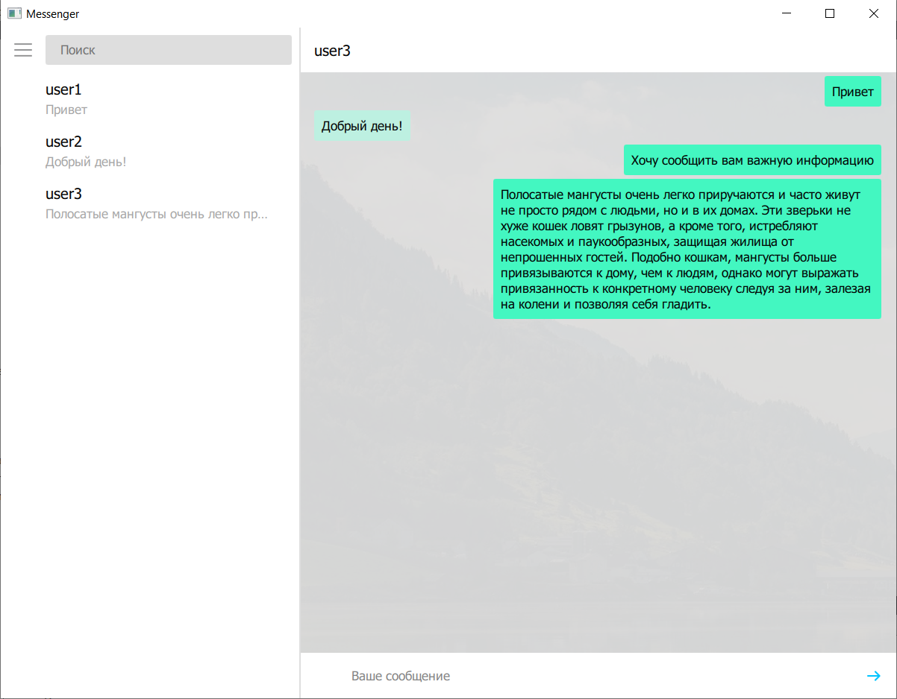

# Messenger
Клиент-серверный десктоп мессенджер. 

На стороне пользователя имеется клиент, в котором он может зарегистрировать свой аккаунт, авторизоваться и писать сообщения другим пользователям. Frontend приложения написан с использованием QML. 

При успешной авторизации сервер отправляет клиенту список пользователей, с которым общается клиент и все сообщения из их диалогов. 

На сервере имеется база данных SQLite, в которой хранятся имена пользователей и хешированные пароли.

